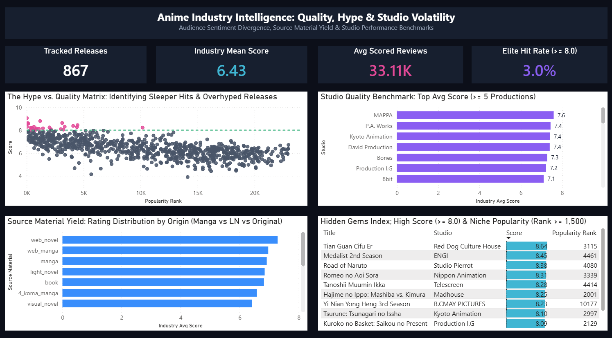

# 🎬 Anime Market Intelligence & Studio Performance Analytics

An end-to-end data analytics and engineering case study evaluating market sentiment, studio volatility, and production yield across hundreds of seasonal anime releases. This project pairs a modular MySQL ELT pipeline with an executive Power BI market intelligence dashboard built on a midnight slate UI (`#0B0F19`).



---

## 📊 Executive Business Intelligence Dashboard

The analytical layer synthesizes release metrics into an interactive single-page dashboard designed for production committees, acquisition teams, and licensing executives:

* **Executive Baseline Ribbon:** Tracks macroeconomic platform health across 867 validated titles: **867** tracked seasonal releases, an **Industry Mean Score of 6.43 / 10**, an average community review volume of **33.11K Scored Reviews** per title, and a selective **3.0% Elite Hit Rate** (titles achieving a critical rating of $\ge 8.00$).
* **The Hype vs. Quality Quadrant Matrix:** Cross-plots critical score against popularity rank across all catalog entries. Identifies high-visibility underperformers (high popularity rank, low score) versus high-satisfaction titles, anchored by a static benchmark line at the elite threshold (Score = 8.00).
* **Studio Quality Benchmarks ($\ge 5$ Productions):** Benchmarks production houses with substantial release volume to identify elite consistency. Highlights top performers like **MAPPA (7.60 avg)**, **P.A. Works (7.40 avg)**, **Kyoto Animation (7.40 avg)**, and **David Production (7.40 avg)**.
* **Source Material Rating Yield:** Compares average critical reception across underlying IP formats, revealing that digital-native origins (**Web Novels** and **Web Manga**) outpace traditional print adaptations and anime-original scripts in average viewer reception.
* **Hidden Gems Index:** Isolates critically acclaimed releases ($\text{Score} \ge 8.00$) that suffer from limited mainstream community penetration ($\text{Popularity Rank} \ge 1,500$), uncovering high-value acquisition targets such as *Tian Guan Cifu Er (8.64)*, *Medalist (8.45)*, and *Romeo no Aoi Sora (8.31)*.

---

## 🛠️ Data Architecture & ELT Pipeline

### Ingestion & Sanitization (`sql/01_elt_staging_and_cleaning.sql`)
* Ingests dirty text strings into a flexible staging table to safely handle malformed CSV rows.
* Sanitizes dirty sentinels (`'N/A'`, `'tbd'`, empty strings) into true SQL `NULL` values.
* Casts text-based numbers and dates into strongly-typed primitives (`DECIMAL(4,2)`, `UNSIGNED`, and `DATE`).
* Creates composite B-Tree indexes across `studio`, `score`, `popularity_rank`, `source_material`, and `release_date` for sub-second analytical filtering.

### Dimensional Modeling & DAX Engine
* **Calculated Metrics:** Built a centralized `_Measures` table housing normalized performance indicators (`Industry Avg Score`, `Elite Hit Rate Pct`, `Avg Review Volume`, and catalog volume counts).
* **Dynamic Visual Formatting:** Configured page-level conditional filtering to isolate active titles from unrated or unreleased records ($Score > 0$), preventing metric distortion.

---

## 🔍 Core SQL Analytical Modules

### 1. Schema Sanitization & Typing (`sql/01_elt_staging_and_cleaning.sql`)
* Builds the production `anime_clean` table with strict data typing, regular-expression pattern matching, and performance indexing.

### 2. Hype vs. Quality Divergence (`sql/02_hype_vs_quality_divergence.sql`)
* Calculates the divergence delta:
  $$\text{Hype Gap} = \text{Score Rank} - \text{Popularity Rank}$$
* Identifies over-marketed titles and isolates sleeper hits with high rating thresholds and deep popularity ranks.

### 3. Studio Quality Gap & Hit-Rate Benchmarks (`sql/03_studio_efficiency_benchmarks.sql`)
* Computes studio volatility by calculating the spread between highest and lowest produced ratings ($\text{Max Score} - \text{Min Score}$).
* Benchmarks studios with $\ge 5$ productions to quantify the percentage of catalog titles reaching elite tier status ($\text{Score} \ge 8.00$).

### 4. Source Material Yield & Demographics (`sql/04_source_and_genre_affinity.sql`)
* Assesses commercial return on original scripts versus adaptations (Manga, Light Novels, Web Novels, Games).
* Uses `UNION ALL` set operations and pattern matching to compare audience reach across major genre categories (Action, Romance, Sci-Fi, Fantasy).

---

## 💻 Tech Stack & Analytical Competencies

* **Business Intelligence:** Microsoft Power BI Desktop, DAX, Custom Dark Themes, UI Hierarchy & Visual Storytelling.
* **Database & Pipeline:** MySQL 8.0, ELT Pipelines, Data Type Sanitization, B-Tree Indexing.
* **Advanced SQL:** Common Table Expressions (CTEs), Window Functions (`DENSE_RANK()`, `SUM() OVER()`), Set Operations (`UNION ALL`), Pattern Matching (`REGEXP`, `LIKE`).
* **Domain Focus:** Media Analytics, Sentiment & Rating Divergence, Entertainment Portfolio Strategy.

---

## 🚀 How to Run Locally

1. **Clone the repository:**
   ```bash
   git clone [https://github.com/saicharanuchiha/anime-sql-analysis.git](https://github.com/saicharanuchiha/anime-sql-analysis.git)
   cd anime-sql-analysis
   ```

2. **Run MySQL Pipeline:**
   * Import your raw data into MySQL Workbench.
   * Execute `sql/01_elt_staging_and_cleaning.sql` to generate the clean, indexed schema.
   * Run analytical scripts `02`, `03`, and `04` to inspect the tabular outputs.

3. **Open Power BI Dashboard:**
   * Launch `anime_market_intelligence.pbix` in Power BI Desktop to interact with the visualizations and review DAX measures.